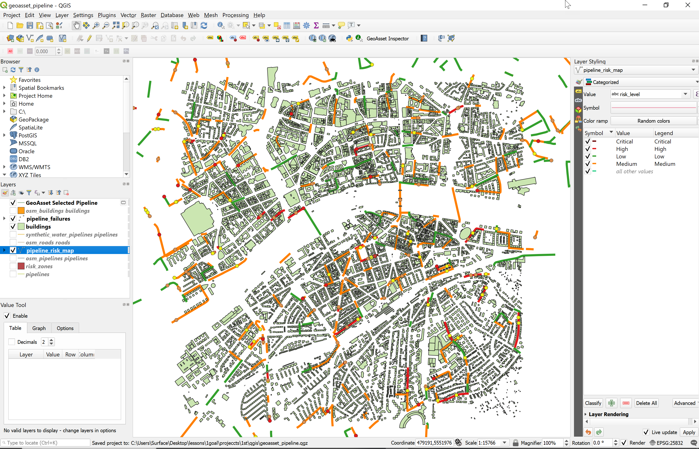
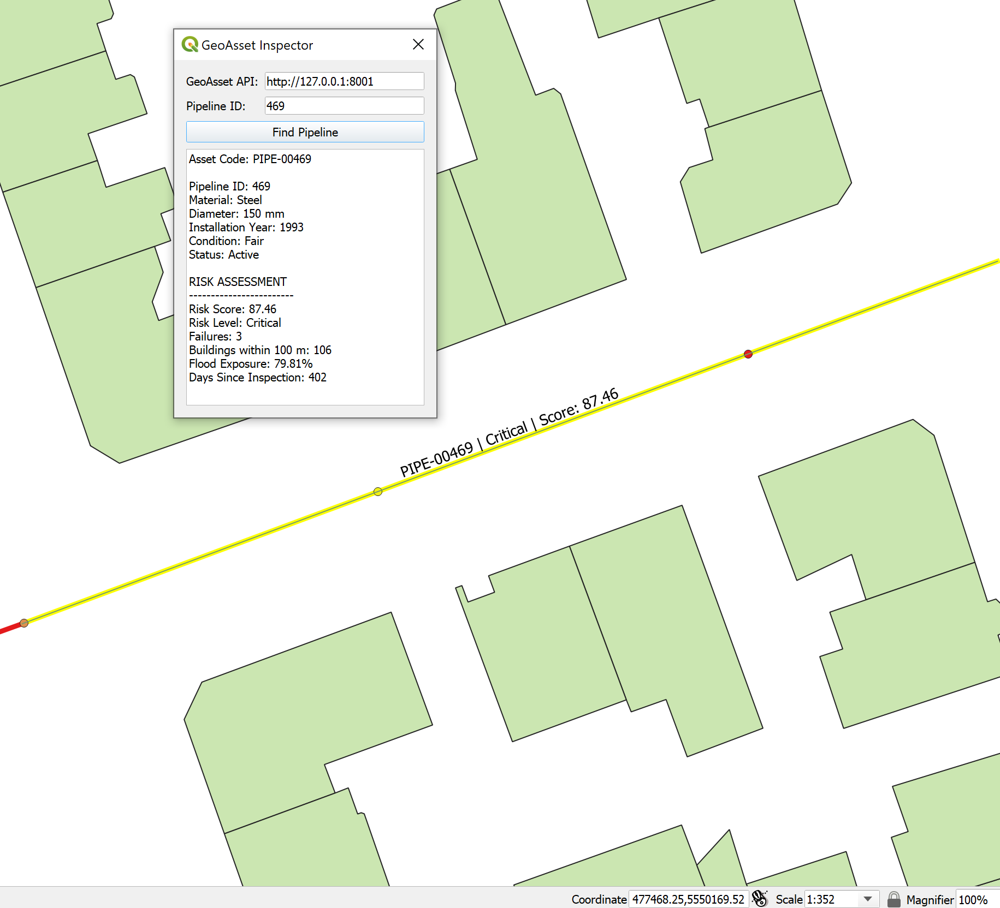
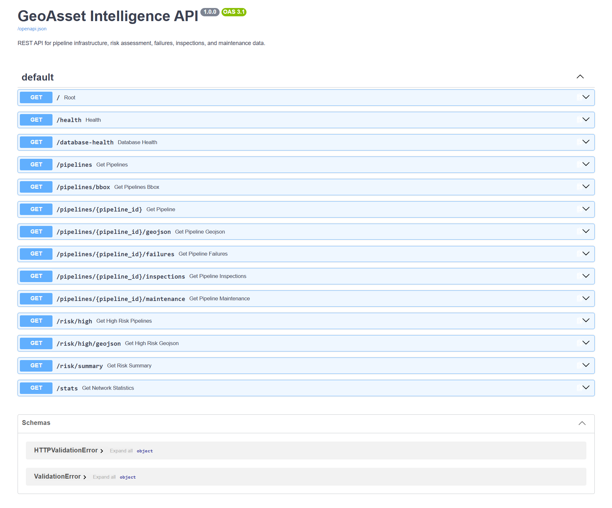

# GeoAsset Intelligence Platform

[](https://github.com/AisunZa/geoasset-intelligence-platform/actions/workflows/ci.yml)

A portfolio-grade **geospatial infrastructure risk and maintenance platform** for municipal water pipelines, built with **QGIS/PyQGIS, PostgreSQL/PostGIS, Python, FastAPI, Docker, Pytest, and GitHub Actions**.

The project demonstrates an end-to-end GIS engineering workflow: spatial data ingestion, ETL, database design, spatial SQL, risk scoring, Python validation, QGIS visualization, a custom PyQGIS inspection tool, REST/GeoJSON delivery, automated testing, and containerized deployment.



## Project at a Glance

| Area | Implementation |
|---|---|
| Spatial database | PostgreSQL + PostGIS |
| ETL / geoprocessing | Python, GeoPandas, Shapely, OSMnx |
| Desktop GIS | QGIS |
| QGIS automation | Custom PyQGIS **GeoAsset Inspector** plugin |
| Risk engine | PostGIS spatial SQL + independent Python validation |
| API | FastAPI REST + JSON/GeoJSON + BBOX queries |
| Testing | Pytest unit and database-backed integration tests |
| Deployment | Docker + Docker Compose |
| CI | GitHub Actions with a real PostGIS service and Docker build validation |

## Problem

Infrastructure operators need a repeatable way to identify assets that should receive inspection or maintenance attention first. This project combines asset condition, inspection recency, failure history, nearby building exposure, and flood exposure into a spatial risk score for each pipeline segment.

It answers questions such as:

- Which pipelines have the highest operational and spatial risk?
- Which assets have repeated failures or overdue inspections?
- Where are pipelines exposed to dense surrounding development?
- Which pipeline segments intersect flood-risk areas?
- How can those results be delivered consistently through QGIS and an API?

## Data

The project uses realistic geospatial context with controlled synthetic infrastructure and operational records:

- **500** pipeline segments generated from real OpenStreetMap road geometry
- **9,865** OpenStreetMap building features
- **267** synthetic failure records
- **1,224** synthetic inspection records
- **318** synthetic maintenance records
- Flood-risk polygons used for spatial exposure analysis
- Project CRS: **EPSG:25832**

> **Data note:** OpenStreetMap provides realistic spatial context. Pipeline assets and operational records are synthetic and are used for demonstration and portfolio purposes.

## Architecture



The workflow is organized around six stages:

**Data Sources → Python ETL → PostGIS → Risk Analysis → QGIS/FastAPI → Testing & Deployment**

## Risk Methodology

Each pipeline receives a score from **0 to 100** using five weighted components:

| Risk factor | Maximum points |
|---|---:|
| Asset age | 25 |
| Days since last inspection | 10 |
| Failure history | 30 |
| Buildings within 100 m | 15 |
| Flood exposure | 20 |
| **Total** | **100** |

Risk classes are assigned as:

| Score | Risk level |
|---:|---|
| 0–30 | Low |
| >30–60 | Medium |
| >60–80 | High |
| >80 | Critical |

PostGIS calculates the production risk metrics using spatial relationships such as proximity and intersection. A separate Python/GeoPandas implementation recalculates the same metrics to validate the SQL results independently.

## Key Results

The final network contains **54.34 km** of pipeline infrastructure. The risk assessment produced:

| Risk level | Pipelines |
|---|---:|
| Low | 210 |
| Medium | 260 |
| High | 29 |
| Critical | 1 |

The highest-risk asset is **PIPE-00469**, with a risk score of **87.46 (Critical)**. It has **3 recorded failures**, **106 buildings within 100 m**, and **79.81% flood exposure**, making it the clearest maintenance-priority example in the dataset.



## QGIS and PyQGIS

The QGIS project visualizes the complete spatial risk model with categorized pipeline symbology for **Low, Medium, High, and Critical** assets, together with buildings, failures, and flood-risk layers.

A custom **GeoAsset Inspector** PyQGIS plugin adds an application layer on top of the analysis. The user can enter a pipeline ID, retrieve current asset and risk information from the FastAPI service, display the risk assessment in QGIS, and automatically zoom to the selected pipeline geometry.

This connects the desktop GIS directly to the API rather than treating the map as a static visualization.

## FastAPI Geospatial API

FastAPI exposes asset, risk, statistics, and spatial-query results as JSON and GeoJSON.

Key endpoints include:

```text
GET /health
GET /database-health
GET /pipelines
GET /pipelines/bbox
GET /pipelines/{pipeline_id}
GET /pipelines/{pipeline_id}/geojson
GET /pipelines/{pipeline_id}/failures
GET /pipelines/{pipeline_id}/inspections
GET /pipelines/{pipeline_id}/maintenance
GET /risk/high
GET /risk/high/geojson
GET /risk/summary
GET /stats
```

The `/pipelines/bbox` endpoint supports spatial bounding-box queries, while GeoJSON endpoints allow results to be loaded directly into GIS clients.



## PostGIS Database Design

Core tables:

```text
pipelines
pipeline_failures
inspections
maintenance
buildings
risk_zones
```

Risk views:

```text
pipeline_risk_metrics
pipeline_risk_assessment
pipeline_risk_map
```

The database uses PostGIS geometry types and spatial indexes to support proximity, intersection, exposure, and map-query operations efficiently.

## Python ETL and Validation

The ETL workflow covers:

- Downloading and processing OSM roads and buildings
- Generating a synthetic water-pipeline network from road geometry
- Generating failures, inspections, and maintenance records
- Importing spatial and operational data into PostGIS
- Calculating risk metrics in Python
- Cross-validating Python results against PostGIS risk views

Primary libraries include **GeoPandas, Shapely, Pandas, SQLAlchemy, Psycopg, and OSMnx**.

## Testing and CI

The project includes both unit and integration testing with **Pytest**.

GitHub Actions automatically:

1. Starts a real **PostGIS** service container
2. Creates the database schema and SQL views
3. Loads deterministic CI test data
4. Runs the full test suite against PostGIS
5. Builds the Docker image

This verifies not only Python logic but also database integration and container build reproducibility.

## Docker

The FastAPI application is containerized using Docker and can connect to the local PostGIS database through Docker Compose.

After the database has been initialized, set the PostgreSQL password in your shell and start the API:

```bat
set GEOASSET_DB_PASSWORD=YOUR_POSTGRESQL_PASSWORD
docker compose up --build
```

Open the interactive API documentation at:

```text
http://127.0.0.1:8001/docs
```

The password is supplied through an environment variable and is not stored in the repository.

## Repository Structure

```text
geoasset-intelligence-platform/
├── api/                 # FastAPI application and database connection
├── database/            # PostGIS schema, views, and CI seed data
├── etl/                 # OSM, generation, import, and risk scripts
├── qgis/                # QGIS project
├── qgis_plugin/         # GeoAsset Inspector PyQGIS plugin
├── test/                # Unit and API/integration tests
├── docs/images/         # Portfolio and documentation visuals
├── Dockerfile
├── docker-compose.yml
├── environment.yml
└── README.md
```

## Technology Stack

**GIS & Spatial:** QGIS, PyQGIS, PostgreSQL, PostGIS  
**Python:** Python 3.13, GeoPandas, Shapely, Pandas, OSMnx  
**Database Access:** SQLAlchemy, GeoAlchemy2, Psycopg  
**API:** FastAPI, Uvicorn  
**Testing & DevOps:** Pytest, Docker, Docker Compose, GitHub Actions  
**Data Formats:** PostGIS geometry, GeoJSON, OpenStreetMap-derived data

## What This Project Demonstrates

This project was designed to demonstrate practical skills relevant to **GIS Developer, Python GIS, PostGIS/Spatial SQL, Geospatial Backend, Spatial Data Engineering, and Infrastructure GIS** roles:

- Designing and querying a spatial relational database
- Building reproducible Python geospatial ETL workflows
- Applying spatial SQL to infrastructure risk analysis
- Validating spatial analytics independently in Python
- Creating professional QGIS visualizations
- Extending QGIS with PyQGIS
- Publishing spatial data through REST and GeoJSON APIs
- Writing automated unit and database-backed integration tests
- Containerizing a geospatial API
- Building CI workflows around PostGIS and Docker

---

**GeoAsset Intelligence Platform** is a demonstration project showing how GIS analysis, spatial databases, Python engineering, desktop GIS, APIs, testing, and deployment can be combined into one reproducible infrastructure-risk workflow.
